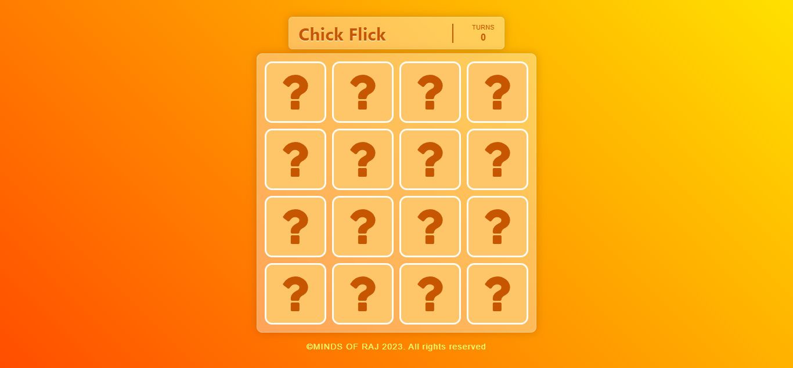
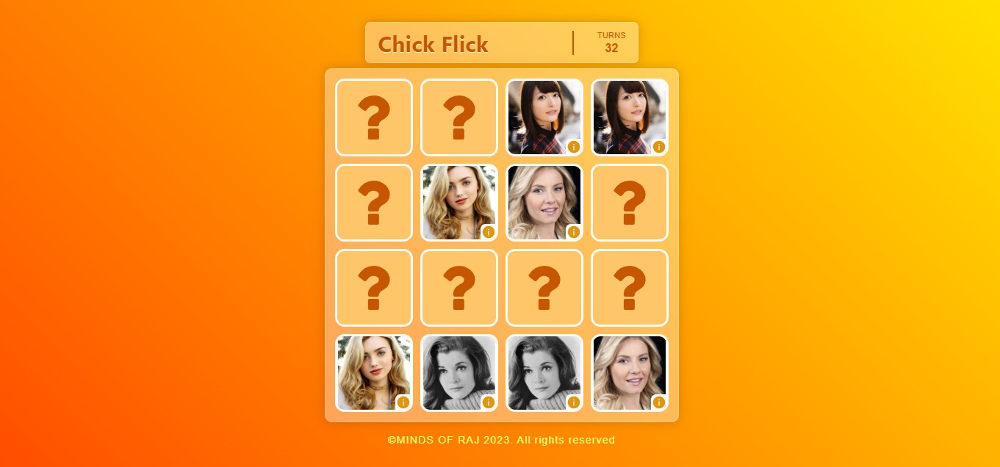

# Chick Flick Memory Card Game

Chick Flick Memory Card Game is a fun and interactive game built using React. Test your memory skills by flipping cards and finding matching pairs of chick flick movie posters!

## Demo
Check out the live demo of the Chick Flick Memory Card Game: [Play Here](https://chick-flick.netlify.app/)

## Features
- Dynamic card images fetched using the TMDB API.
- Memory testing gameplay with chick flick movie posters.
- Simple and intuitive user interface.
- Responsive design for various screen sizes.

## Built With
- React - JavaScript library for building user interfaces.
- TMDB API - Fetch chick flick movie poster images.

## Enjoy the nostalgia and fun of chick flicks while sharpening your memory! 🍿🎬🃏

